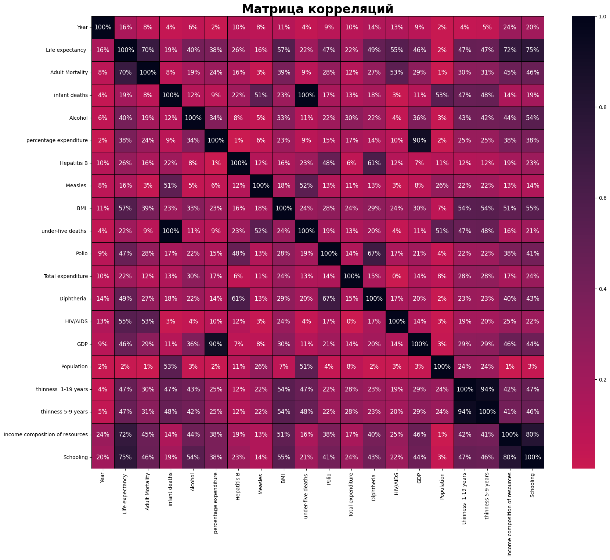
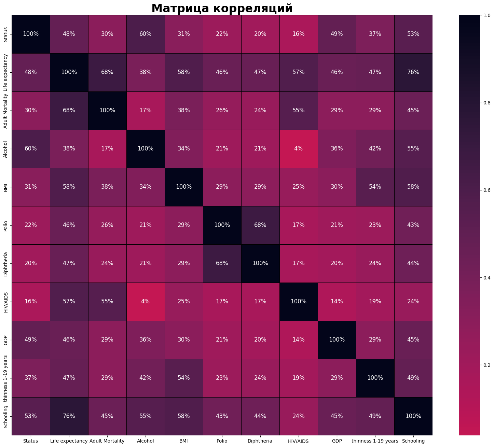

# Методы искусственного интеллекта в мехатронике и робототехнике

**Номер лабораторной:** 1-2  
**Вариант:** 20  
**Студент:** Якушев Никита Евгеньевич  
**Группа:** 8EM51  
**Преподаватель:** Александр Павловский    

## 1. Цель и задачи работы

### Цель работы
Получение навыков анализа первичных данных и определение признаков взаимосвязи (EDA), понимания моделей: линейная регрессия, дерево решений, CatBoost, XGBoost, нейронные сети (MLP) и умения разрабатывать программу на языке Python для реализации представленных моделей.

>**Задание**: Создать модель линейной регрессии для **предсказания ожидаемой продолжительности жизни**, на основе предоставленных данных.

### Задачи
1. Провести **разведочный анализ данных (EDA)** – определить влияние признаков, выбрать наиболее значимые для предсказания.
2. Построить *пайплайн* обработки и обучения с использованием **DVC**.
3. Реализовать **линейную регрессию**, вычислить веса, метрики и ошибки.
4. Реализовать **дерево решений**, вычислить метрики, ошибки, визуализировать первые узлы.
5. Реализовать **CatBoost** – метрики, ошибки, выгрузить важность признаков.
6. Реализовать **XGBoost** – метрики, ошибки, выгрузить важность признаков.
7. Реализовать **нейронную сеть (MLP)** – метрики, ошибки, кривые обучения, гистограммы весов, график TensorBoard.
8. Выгрузить итоговый **вычислительный граф DVC**.
9. Построить сводную таблицу метрик и сделать вывод о лучшей модели.
10. Сформулировать общий вывод по работе.

## 2. Используемые инструменты

>**Git**: Позволяет отслеживать изменения кода, скриптов и конфигураций DVC. Обеспечивает совместную работу, возможность отката к предыдущим состояниям и публикацию проекта на GitHub.

>**venv**: Позволяет сделать изолированную среда Python для разработки (для работы с несколькими проектами на разных версиях библиотек). Также позволяет работать через [requirements.txt](requirements.txt), что позволяет достаточно быстро развернуть решение на другом устройстве.

>**DVC (Data Version Control)**: Позволяет управлять версиями данных, моделей и пайплайнов. Позволяет строить вычислительные графы.

## 3. Описание датасета (первичный анализ данных)

**Источник данных:**  [Annotation_20](data\Annotation.md)   
**Данные:**  [life_expectancy_data](data\life_expectancy_data.csv)  
**Файл с анализом датасета:**  [EDA](notebook\EDA.ipynb)

**Структура:**  
Файл [life_expectancy_data](data\life_expectancy_data.csv) содержит **22 столбца** и **2731 строк**.

**Перечень признаков (кратко):**
| Признак | Описание | Тип данных |
|---------|----------|------------|
| Country | Страна | String |
| Year | Год | Int64 |
| Status | Статус (развитая / развивающаяся) | String |
| **Life expectancy** | **Ожидаемая продолжительность жизни** | **Float64** |
| Adult Mortality | Смертность взрослых (15–60 лет) на 1000 населения | Float64 |
| infant deaths | Младенческая смертность на 1000 населения | Int64 |
| Alcohol | Потребление алкоголя на душу населения (15+) | Float64 |
| percentage expenditure | Расходы на здравоохранение в % от ВВП на душу | Float64 |
| Hepatitis B | Охват вакцинацией против гепатита B (%) | Float64 |
| Measles | Заболеваемость корью на 1000 населения | Int64 |
| BMI | Средний индекс массы тела | Float64 |
| under-five deaths | Смертность детей до 5 лет на 1000 населения | Int64 |
| Polio | Охват вакцинацией против полиомиелита (%) | Float64 |
| Total expenditure | Госрасходы на здравоохранение (% от всех госрасходов) | Float64 |
| Diphtheria | Охват вакцинацией DTP3 (%) | Float64 |
| HIV/AIDS | Смертность от ВИЧ/СПИДа (0–4 года) на 1000 живорождений | Float64 |
| GDP | ВВП на душу населения (USD) | Float64 |
| Population | Население страны | Float64 |
| thinness 1-19 years | Распространённость худобы (10–19 лет, %) | Float64 |
| thinness 5-9 years | Распространённость худобы (5–9 лет, %) | Float64 |
| Income composition of resources | Индекс человеческого развития (0–1) | Float64 |
| Schooling | Средняя продолжительность обучения (лет) | Float64 |

## 4. Разведочный анализ данных (EDA)

### 4.1 Этап обработки

**Целевая переменная**: `Life expectancy`.

Для выявления действий для преобразования датасета необходимо следующее:
- Использованием методов `info`, `describe`, `unique`, `duplicated` и `isnull` библиотеки `pandas` **для получения информации о содержании датасета**.
- Создание **Confusion Matrix** (матрицы корреляции данных).
- Построение **гистограмм** для анализа распределения данных

После проведенного анализа были сделаны следующие выводы:
1. Признак `Country` состоит из 191 уникальных значений, при этом данный признак является вторичным (другие признаки так или иначе отражают характеристики стран). Было принято решение об **удалении признака `Country`**.
2. Признак `Status` является категориальным типом данным `String` и состоит из двух значений `[Developing, Developed]`. В дальнейшем будет исследована его корреляция относительно `Life expectancy`.
3. Выбросы и дубликаты данных отсутствуют (данные являются **статистическими**).
4. Признаки `Year` и `Total expenditure` слабо коррелируют с другими данными, поэтому он будет удален.
5. Признак `Population`, `Measles`, `Hepatitis B`,`under-five deaths` и `infant deaths` имеют низкую корреляцию с целевым признаком. Подлежит удалению.
6. Присутствуют признаки, которые сильно коррелируют между собой: `percentage expenditure` - `GDP`, `thinness  1-19 years` - `thinness 5-9 years` и `Income composition of resources` - `Schooling`. Из данных пар будут удалены те признаки, которые наименее коррелируют с целевым признаком, то есть: `percentage expenditure`, `thinness 5-9 years` и `Income composition of resources`.
7. В датасете присутствуют строки с пропусками (NaN): `Life expectancy`, `Adult Mortality`, `Alcohol`, `BMI`, `Polio`, `Diphtheria`, `GDP`, `thinness  1-19 years`, `Schooling`. Существует два варианта решения проблемы: заполнение данных медианным значением и удаление строк. В нашем случае для всех признаков произведем **удаление строк**.
8. Все признаки (кроме `Status`) должны быть нормализованы от -1 до 1.
9. Разделение датасета на обучающую, валидационную и тестовую выборки в процорции 70:20:10.

### 4.2 Результаты EDA

---
